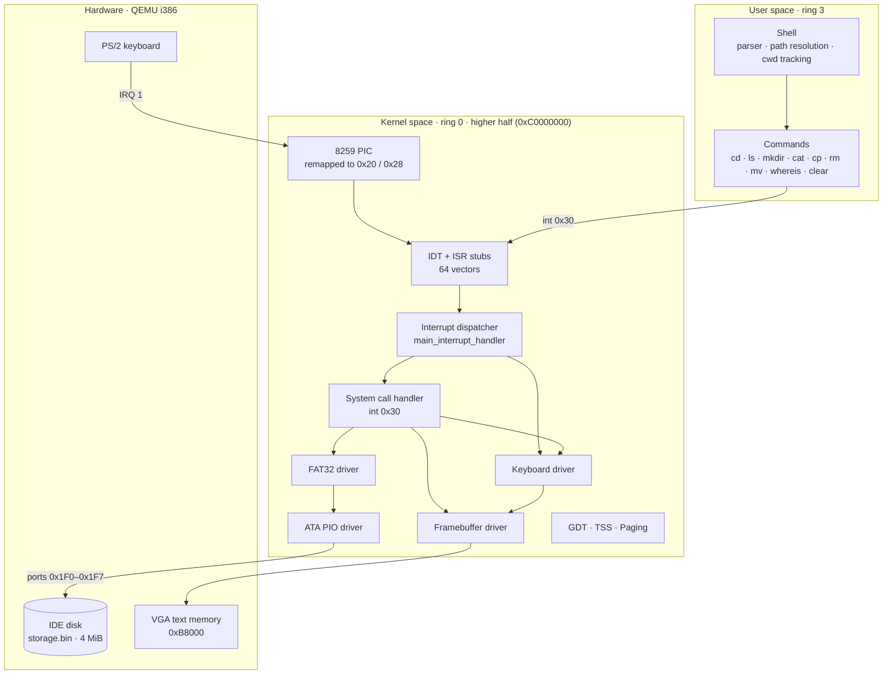
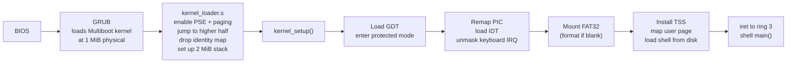
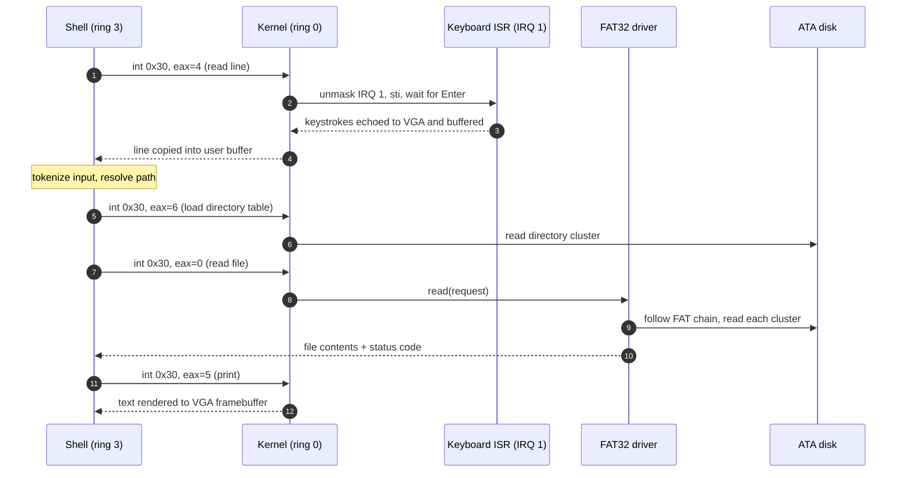

<div align="center">

# ApaGaKeOS

**A 32-bit x86 operating system written from scratch in C and NASM.**

It boots through GRUB into a higher-half kernel with paging, interrupts, hardware drivers and a custom FAT32 filesystem, then starts a user-mode shell in ring 3.


-555555)


</div>

---

## Overview

ApaGaKeOS is a small monolithic kernel for the Intel i386 architecture, written without any standard library. There is no libc, no runtime and no external dependencies. Every piece between the bootloader and the shell prompt is implemented in this repository: segmentation, paging, interrupt handling, drivers, the filesystem, the system call interface and user space.

```text
                          _____       _  __     ____   _____    ____   _____
       /\                / ____|     | |/ /    / __ \ / ____|  / __ \ / ____|
      /  \   _ __   __ _| |  __  __ _| ' / ___| |  | | (___   | |  | | (___
     / /\ \ | '_ \ / _` | | |_ |/ _` |  < / _ \ |  | |\___ \  | |  | |\___ \
    / ____ \| |_) | (_| | |__| | (_| | . \  __/ |__| |____) | | |__| |____) |
   /_/    \_\ .__/ \__,_|\_____|\__,_|_|\_\___|\____/|_____/   \____/|_____/
            | |
            |_|
                          ApaGaKeOS - version 1.0.0

ApaGaKeOS@OS-IF2230:/$ ls
shell
kaikai.txt
lain.txt
ApaGaKeOS@OS-IF2230:/$ mkdir docs
ApaGaKeOS@OS-IF2230:/$ cd docs
ApaGaKeOS@OS-IF2230:/docs$ _
```

## Highlights

| Area | What's implemented |
| --- | --- |
| **Boot** | Multiboot-compliant kernel loaded by GRUB from a bootable ISO (El Torito) |
| **CPU mode** | 32-bit protected mode with a hand-built **GDT** (kernel and user code/data segments, plus a **TSS**) |
| **Memory** | **Higher-half kernel** mapped at `0xC0000000` using **4 MiB pages** (PSE), and a physical frame allocator for user memory |
| **Interrupts** | **IDT** with 64 vectors generated from a NASM macro table, a remapped **8259 PIC**, and handlers for CPU exceptions and IRQs |
| **Drivers** | PS/2 **keyboard** (scancode set 1), VGA **text-mode framebuffer** (80×25, hardware cursor), **ATA PIO** disk (LBA28), **CMOS RTC** |
| **Filesystem** | Custom **FAT32** implementation with nested directories and full create, read, write and delete support |
| **User space** | **Ring 3** shell, entered via `iret`, that talks to the kernel only through the `int 0x30` **system call** gate |
| **Shell** | `cd` `ls` `mkdir` `cat` `cp` `rm` `mv` `whereis` `clear`, with absolute and relative paths and multiple arguments |
| **Tooling** | Host-side disk-image inserter, one-command ISO build, and source-level GDB debugging of both kernel and shell |

## Architecture



### Boot sequence



### Life of a shell command

This is what happens when you type `cat notes.txt`. The shell never touches hardware directly. Every privileged operation goes through the `int 0x30` gate, and the TSS switches the CPU back onto the kernel stack.



## Memory layout

The kernel is linked at `0xC0100000` but loaded by GRUB at physical `0x00100000`. Paging maps the first 4 MiB of physical memory into the top of the address space, so the kernel runs in the higher half. Each user program gets its own 4 MiB frame at virtual `0x0`.

| Virtual range | Maps to (physical) | Contents |
| --- | --- | --- |
| `0x00000000 – 0x003FFFFF` | next free 4 MiB frame (`0x00400000`) | User program: code at `0x0`, stack grows down from `0x003FFFFC` |
| `0xC0000000 – 0xC03FFFFF` | `0x00000000 – 0x003FFFFF` | Kernel: VGA buffer at `0xC00B8000`, kernel image at `0xC0100000`, 2 MiB kernel stack in `.bss` |

**GDT:**

| Selector | Segment | DPL |
| --- | --- | --- |
| `0x00` | Null | – |
| `0x08` | Kernel code | 0 |
| `0x10` | Kernel data | 0 |
| `0x18` | User code | 3 |
| `0x20` | User data | 3 |
| `0x28` | TSS (`esp0` / `ss0` for ring 3 → 0 transitions) | 0 |

## System call interface

User programs trigger `int 0x30`. The IDT marks vectors `0x30–0x3F` as DPL 3, so ring 3 is allowed to invoke them. The syscall number goes in `eax` and arguments go in `ebx`, `ecx` and `edx`.

| `eax` | Call | `ebx` | `ecx` | `edx` |
| :-: | --- | --- | --- | --- |
| 0 | Read file | `FAT32DriverRequest*` | `int8_t*` status | – |
| 1 | Read directory | `FAT32DriverRequest*` | `int8_t*` status | – |
| 2 | Write file / create directory | `FAT32DriverRequest*` | `int8_t*` status | – |
| 3 | Delete file / empty directory | `FAT32DriverRequest*` | `int8_t*` status | – |
| 4 | Read a line from the keyboard (blocking) | `char*` buffer | length | – |
| 5 | Print string | `char*` buffer | length | VGA color |
| 6 | Load directory table by cluster | `FAT32DirectoryTable*` | cluster number | – |
| 7 | Clear screen | – | – | – |

## Filesystem

The disk is a 4 MiB raw IDE image formatted with a FAT32 variant. On first boot the kernel checks the boot sector for its signature and formats the disk if the signature is missing.

```text
 Cluster     0                1                  2                  3 …
          ┌────────────────┬──────────────────┬──────────────────┬───────────────────┐
          │  Boot sector   │  File Allocation │  Root directory  │  File & directory │
          │  + FS signature│  Table (FAT)     │  table           │  data clusters    │
          └────────────────┴──────────────────┴──────────────────┴───────────────────┘
          1 cluster = 4 sectors × 512 B = 2 KiB
```

- **FAT chain:** each file is a linked list of clusters in the FAT, terminated by `0x0FFFFFFF`.
- **Directory table:** one cluster holding 64 × 32-byte entries in 8.3 format. Entry 0 always describes the directory itself and stores its **parent cluster**. That back-pointer is what makes `cd ..` and full-path prompt rendering possible without a separate `..` entry.
- **Timestamps:** `fat32.c` stamps create, modify and access times from the CMOS real-time clock. `fat-32-no-cmos.c` is the same driver without the RTC dependency. It is used by the default kernel build and by the host-side inserter, which cannot do port I/O.
- **Build-time provisioning:** `bin/inserter` is a native Linux build of the same FAT32 driver with the disk I/O swapped for memory copies. It writes the compiled shell straight into `storage.bin`.

## Shell

| Command | Description |
| --- | --- |
| `cd <dir>` | Change directory. Supports `..`, absolute paths and relative paths |
| `ls [dir ...]` | List one or more directories |
| `mkdir <dir> ...` | Create one or more directories |
| `cat <file> ...` | Print one or more files |
| `cp <src> ... <dest>` | Copy files to a file or into a directory |
| `mv <src> <dest>` | Move or rename a file or directory |
| `rm <path> ...` | Remove one or more files or empty directories |
| `whereis <name> ...` | Recursively search the filesystem (depth-first) and print every match |
| `clear` | Clear the screen |

Filenames can be given with or without their extension. Errors follow familiar Unix wording, for example `cat: 'foo': No such file or directory`.

## Getting started

### Prerequisites

The build targets Linux. WSL2 on Windows works.

```bash
sudo apt install build-essential nasm qemu-system-x86 genisoimage
```

### Build

```bash
git clone https://github.com/AustinPardosi/Operating-System-32-bit-x86-Architecture.git
cd Operating-System-32-bit-x86-Architecture
make all
```

`make all` builds everything into `bin/`:

1. Compiles the kernel and links it into an ELF32 image (`bin/kernel`)
2. Creates a blank 4 MiB disk (`bin/storage.bin`)
3. Builds the shell as a flat binary and inserts it into the disk
4. Packages GRUB and the kernel into a bootable ISO (`bin/OS2023.iso`)

### Run

```bash
qemu-system-i386 \
  -drive file=bin/storage.bin,format=raw,if=ide,index=0,media=disk \
  -cdrom bin/OS2023.iso
```

### Debug

Add `-s -S` to the QEMU command to start the VM paused with a GDB stub on port `1234`, then attach:

```bash
gdb -ex "target remote :1234" \
    -ex "symbol-file bin/kernel" \
    -ex "add-symbol-file bin/shell_elf" \
    -ex "continue"
```

In VS Code, the included **Kernel** launch configuration does all of this for you. It builds, boots QEMU, attaches GDB and loads symbols for both the kernel and the shell, so you can set breakpoints across the ring 0 / ring 3 boundary.

## Project structure

```text
.
├── makefile                  # Build pipeline: kernel → disk → shell → ISO
├── other/grub1               # GRUB legacy El Torito stage2
└── src
    ├── linker.ld             # Higher-half kernel link script (VMA 0xC0100000, LMA 0x100000)
    ├── menu.lst              # GRUB menu
    ├── kernel/               # Multiboot entry, paging bootstrap, ring 3 jump, kernel_setup()
    ├── gdt/                  # Global Descriptor Table and TSS
    ├── interrupt/            # IDT, ISR stubs (NASM), PIC, exception and syscall dispatch
    ├── paging/               # Page directory and user frame allocation
    ├── keyboard/             # PS/2 keyboard driver and line buffering
    ├── framebuffer/          # VGA text-mode driver and hardware cursor
    ├── filesystem/           # ATA PIO disk driver, CMOS RTC, FAT32
    ├── portio/               # in/out port I/O primitives
    ├── std/                  # Freestanding memcpy, memcmp, strlen and friends
    ├── inserter/             # Host tool that writes files into the disk image
    └── user/                 # Ring 3 shell and its commands, user linker script
```

## Design notes and future work

These are deliberate scope limits for a teaching-sized kernel, and natural next steps:

- **Single task:** there is one user program and no scheduler. Next steps would be a PIT timer, context switching and a process table.
- **Simple allocator:** memory comes in 4 MiB pages from a bump allocator and is never freed. A bitmap frame allocator and 4 KiB page tables would fix that.
- **Filesystem limits:** names are 8.3 only, and each directory fits in a single cluster (63 entries).
- **Fault handling:** a page fault halts the CPU. It could instead report the fault and kill the offending process.

## Team

<table>
  <tr>
    <td align="center"><a href="https://github.com/GoDillonAudris512"><br/><sub><b>Go Dillon Audris</b></sub></a></td>
    <td align="center"><a href="https://github.com/AustinPardosi"><br/><sub><b>Austin Gabriel Pardosi</b></sub></a></td>
    <td align="center"><a href="https://github.com/mikeleo03"><br/><sub><b>Michael Leon Putra Widhi</b></sub></a></td>
    <td align="center"><a href="https://github.com/Nat10k"><br/><sub><b>Nathan Tenka</b></sub></a></td>
  </tr>
</table>

## Acknowledgements

- Built in 2023 as part of the Operating Systems course (IF2230) at Institut Teknologi Bandung. The FAT32 "IF2230 edition" specification and the initial scaffolding were provided by Lab Sister ITB.
- [OSDev Wiki](https://wiki.osdev.org/) and the [Intel® 64 and IA-32 Architectures Software Developer's Manual](https://www.intel.com/content/www/us/en/developer/articles/technical/intel-sdm.html), Volume 3A.
